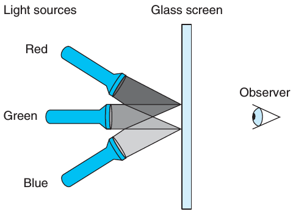

<meta http-equiv="Content-Type" content="text/html; charset=utf-8">
2.1 Perform the following number conversions

    A. 0x39A7F8 to binary
    B. Binary 1100100101111011 to hexadecimal
    C. 0xD5E4C to binary
    D. Binary 1001101110011110110101 to hexadecimal

2.2 Fill in the blank entries in the following table, giving the decimal and hexadecimal representations of different powers of 2:

n |2^n (Decimal)|2^n (Hexadecimal)
--|-------------|-----------------
9 |512          |0x200
19|__           |__
__|16384        |__
__|__           |0x10000
17|__           |__
__|32           |__
__|__           |0x80

2.3 A single byte can be represented by two hexadecimal digits. Fill in the missing entries in the following table, giving the decimal, binary, and hexadecimal values of different byte patterns:

Decimal|Binary  |Hexadecimal
-------|--------|-----------
0      |00000000|0x00
167    |__      |__
62     |__      |__
188    |__      |__
__     |00110111|__
__     |10001000|__
__     |11110011|__
__     |__      |0x52
__     |__      |0xAC
__     |__      |0xE7

2.4 Without converting the numbers to decimal or binary, try to solve the follow-ing arithmetic problems, giving the answers in hexadecimal. Hint: Just modify the methods you use for performing decimal addition and subtraction to use base 16.

    A. 0x503c + 0x8 = __
    B. 0x503c − 0x40 = __
    C. 0x503c + 64 = __
    D. 0x50ea − 0x503c = __

2.5 Consider the following three calls to show_bytes:
    
    int val = 0x87654321;
    byte_pointer valp = (byte_pointer) &val;
    show_bytes(valp, 1); /* A. */
    show_bytes(valp, 2); /* B. */
    show_bytes(valp, 3); /* C. */
Indicate which of the following values will be printed by each call on a little-endian machine and on a big-endian machine:
    
    A. Little endian:__    Big endian:__
    B. Little endian:__    Big endian:__
    C. Little endian:__    Big endian:__

2.6 Using show_int and show_float, we determine that the integer 3510593 has hexadecimal representation 0x00359141, while the floating-point number 3510593.0 has hexadecimal representation 0x4A564504.
    
    A. Write the binary representations of these two hexadecimal values.
    B. Shift these two strings relative to one another to maximize the number of matching bits. How many bits match?
    C. What parts of the strings do not match?

2.7 What would be printed as a result of the following call to show_bytes?
    
    const char *s = "abcdef";
    show_bytes((byte_pointer) s, strlen(s));
Note that letters ‘a’ through ‘z’ have ASCII codes 0x61 through 0x7A.

2.8 Fill in the following table showing the results of evaluating Boolean operations on bit vectors.

Operation|Result
---------|----------
a        |[01101001]
b        |[01010101]
~a       |__
~b       |__
a & b    |__
a \| b   |__
a ^ b    |__

2.9 Computers generate color pictures on a video screen or liquid crystal display by mixing three different colors of light: red, green, and blue.
Imagine a simple scheme, with three different lights, each of which can be turned on or off, projecting onto a glass screen:

We can then create eight different colors based on the absence(0) or presence(1) of light sources R, G, and B:

R|G|B|Color
-|-|-|-------
0|0|0|Black
0|0|1|Blue
0|1|0|Green
0|1|1|Cyan
1|0|0|Red
1|0|1|Magenta
1|1|0|Yellow
1|1|1|White

Each of these colors can be represented as a bit vector of length 3, and we can apply Boolean operations to them.
    
    A. The complement of a color is formed by turning off the lights that are on and turning on the lights that are off.
        What would be the complement of each of the eight colors listed above?
    B. Describe the effect of applying Boolean operations on the following colors:

        Blue | Green = __
        Yellow & Cyan = __
        Red ^ Magenta = __
2.10 As an application of the property that a ^ a = 0 for any bit vector a, consider the following program:

    void inplace_swap(int *x, int *y)
    {
        *y = *x ^ *y; /* Step 1 */
        *x = *x ^ *y; /* Step 2 */
        *y = *x ^ *y; /* Step 3 */
    }
As the name implies, we claim that the effect of this procedure is to swap the values stored at the locations denoted by pointer variables x and y.
Note that unlike the usual technique for swapping two values, we do not need a third location to temporarily store one value while we are moving the other.
There is no performance advantage to this way of swapping; it is merely an intellectual amusement.

Starting with values a and b in the locations pointed to by x and y, respectively, fill in the table that follows, giving the values stored at the two locations after each step of the procedure.
Use the properties of ^ to show that the desired effect is achieved. Recall that every element is its own additive inverse (that is, a ^ a = 0).

Step     |*x|*y
---------|--|--
Initially|a |b
Step 1   |__|__
Step 2   |__|__
Step 3   |__|__

2.11 Armed with the function inplace_swap from Problem 2.10, you decide to write code that will reverse the elements of an array by swapping elements from opposite
ends of the array, working toward the middle.
You arrive at the following function:
    
    void reverse_array(int a[], int cnt)
    {
        int first, last;
        for(first = 0, last = cnt-1; first <= last; first++, last--) {
            inplace_swap(&a[first], &a[last]);
        }
    }
When you apply your function to an array containing elements 1, 2, 3, and 4, you find the array now has, as expected, elements 4, 3, 2, and 1.
When you try it on an array with elements 1, 2, 3, 4, and 5, however, you are surprised to see that the array now has elements 5, 4, 0, 2, and 1.
In fact, you discover that the code always works correctly on arrays of even length, but it sets the middle element to 0 whenever the array has odd length.
    
    A. For an array of odd length cnt = 2k + 1, what are the values of variables first and last in the final iteration of function reverse_array?
    B. Why does this call to function xor_swap set the array element to 0?
    C. What simple modification to the code for reverse_array would eliminate this problem?
 
2.12 Write C expressions, in terms of variable x, for the following values.
Your code should work for any word size w ≥ 8.
For reference, we show the result of evaluating the expressions for x = 0x87654321, with w = 32.

     A. The least significant byte of x, with all other bits set to 0. [0x00000021].
     B. All but the least significant byte of x complemented, with the least significant byte left unchanged. [0x789ABC21].
     C. The least significant byte set to all 1s, and all other bytes of x left unchanged. [0x876543FF].

2.13 The Digital Equipment VAX computer was a very popular machine from the late 1970s until the late 1980s.
Rather than instructions for Boolean operations And and Or, it had instructions bis (bit set) and bic (bit clear).
Both instructions take a data word x and a mask word m. They generate a result z consisting of the bits of x modified according to the bits of m.
With bis, the modification involves setting z to 1 at each bit position where m is 1.
With bic, the modification involves setting z to 0 at each bit position where m is 1.
To see how these operations relate to the C bit-level operations, assume we have functions bis and bic implementing the bit set and bit clear operations, and that we want to use these to implement functions computing bit-wise operations | and ^, without using any other C operations.
Fill in the missing code below.
Hint: Write C expressions for the operations bis and bic.

    /* Declarations of functions implementing operations bis and bic */
    int bis(int x, int m);
    int bic(int x, int m);
    /* Compute x|y using only calls to functions bis and bic */
    int bool_or(int x, int y)
    {
        int result = __;
        return result;
    }
    /* Compute x^y using only calls to functions bis and bic */
    int bool_xor(int x, int y)
    {
        int result = __;
        return result;
    }

2.14 Suppose that x and y have byte values 0x66 and 0x39, respectively. Fill in the following table indicating the byte values of the different C expressions:

Expression|Value|Expression|Value
----------|-----|----------|-----
x & y     |__   |x && y    |__
x \| y    |__   |x \|\| y  |__
~x \| ~y  |__   |!x \|\| !y|__
x & !y    |__   |x && ~y   |__

2.15 Using only bit-level and logical operations, write a C expression that is equivalent to x == y. In other words, it will return 1 when x and y are equal, and 0 otherwise.

2.16 Fill in the table below showing the effects of the different shift operations on single-byte quantities.
The best way to think about shift operations is to work with binary representations.
Convert the initial values to binary, perform the shifts, and then convert back to hexadecimal. Each of the answers should be 8 binary digits or 2 hexadecimal digits.

x's Hex|x's Binary|x<<3's Binary|x<<3's Hex|x>>2(Logical)'s Binary|x>>2(Logical)'s Hex|x>>2(Arithmetic)'s Binary|x>>2(Arithmetic)'s Hex
-------|----------|-------------|----------|----------------------|-------------------|-------------------------|----------------------
0xC3   |__        |__           |__        |__                    |__                 |__                       |__
0x75   |__        |__           |__        |__                    |__                 |__                       |__
0x87   |__        |__           |__        |__                    |__                 |__                       |__
0x66   |__        |__           |__        |__                    |__                 |__                       |__

2.17 Assuming w = 4, we can assign a numeric value to each possible hexadecimal digit, assuming either an unsigned or a two’s-complement interpretation.
Fill in the following table according to these interpretations by writing out the nonzero powers of two in the summations shown in Equations 2.1 and 2.3:

Hexadecimal|Binary|B2U4(x)|B2T4(x) 
-----------|------|------------------|------------------
0xE        |[1110]|2^3+2^2+2^1=14    |-2^3+2^2+2^1=-2 
0x0        |__    |__                |__
0x5        |__    |__                |__
0x8        |__    |__                |__
0xD        |__    |__                |__
0xF        |__    |__                |__
